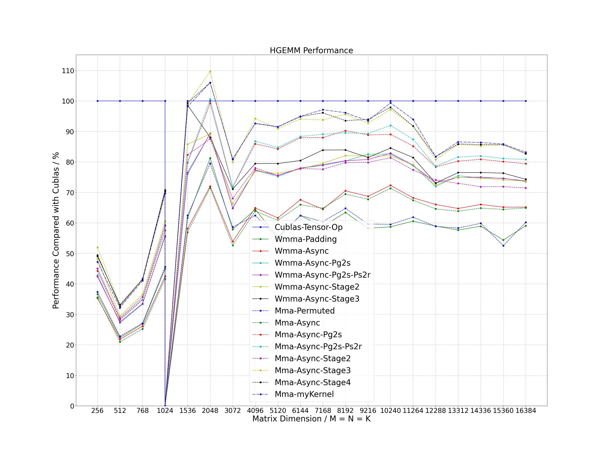
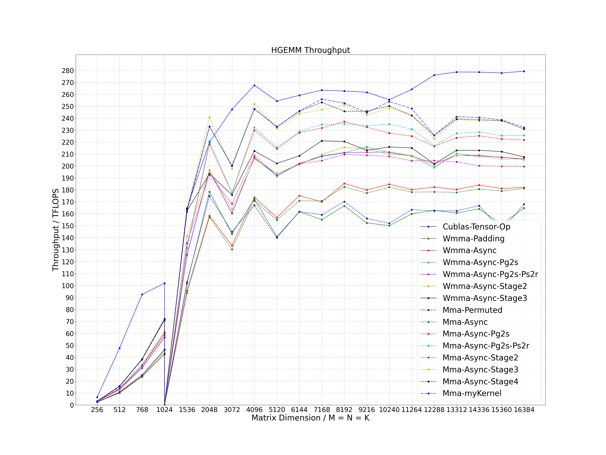

I've been working to optimize CUDA work done by the author of this GitHub Repo: https://github.com/Bruce-Lee-LY/cuda_hgemm

Writing and profiling and HGEMM is associated with a lot of "infrastructure" - everything from collecting/printing low-level specs about the GPU being used on to creating functions to initialize matrices + check the correctness of HGEMMs. The author of the GitHub repo linked above has done an amazing job creating robust HGEMM infra, which I've been able to leverage - I've been able to dive straight into writing + profiling my own CUDA kernels (found throughout this folder)

All my work is being tested on an RTX 4090, a GPU my PhD mentor (Benjamin F. Spector, Hazy Research SAIL) has very kindly given me SSH-access to

README from https://github.com/Bruce-Lee-LY/cuda_hgemm:

# CUDA HGEMM
Several optimization methods of half-precision general matrix multiplication (HGEMM) using tensor core with WMMA API and MMA PTX instruction. The calculation expression is as follows, where the precision of matrix A (M * K), B (K * N) and C (M * N) is FP16. Through exploring various matrix tiling and optimization methods, the current performance between 256 to 16384 dimensions is not less than 95% of the performance of cublas, and in many scenarios, it exceeds the performance of cublas.
```
C (M * N) = A (M * K) * B (K * N)
```



# In the images above, you see that a couple of the kernels I've written/optimized actually outperform CuBLAS (for specific M,N,K)

# Optimization Method
- Tiling: 256 * 128 for block tiling size and 64 * 64 for warp tiling size
- Coalescing Access: using wide instruction access to global memory
- Data Reuse: using shared memory to reuse data of matrix A and B
- Async Copy: using asynchronous copy operation with non-blocking instruction
- Bank Conflict: using padding method for WMMA API and permuted method for MMA PTX instruction to eliminate bank conflict
- L2 Cache: using swizzle access mode to increase L2 cache hit ratio
- Register Reuse: calculating as "Right Left Right Left" for the internal tile of warp
- Pg2s: double-buffer algorithm using prefetching global memory to shared memory
- Ps2r: double-buffer algorithm using prefetching shared memory to register
- Stage: multi-buffer algorithm using prefetching global memory to shared memory

# Compile
## Environment
- OS: Linux
- Cmake Version: >= 3.12
- GCC Version: >= 4.8
- CUDA Version: >= 11.0
- Gflags: install on ubuntu as follows
```
sudo apt-get install libgflags-dev
```

## Clone
```
git clone https://github.com/Bruce-Lee-LY/cuda_hgemm.git
```

## Build
### NVIDIA A100
```
cd cuda_hgemm
./build.sh -a 80 -t Release -b OFF
./build.sh -a 80 -t Debug -b OFF
```

### RTX3080Ti / RTX3090 / RTX A6000 / RTX 4090
```
cd cuda_hgemm
./build.sh -a 86 -t Release -b OFF
./build.sh -a 86 -t Debug -b OFF
```

# Run Sample
```
./run_sample.sh
```

# Performance
Process the data in the log and plot it as a line chart.

```
cd tools/performance
./performance.sh
```
